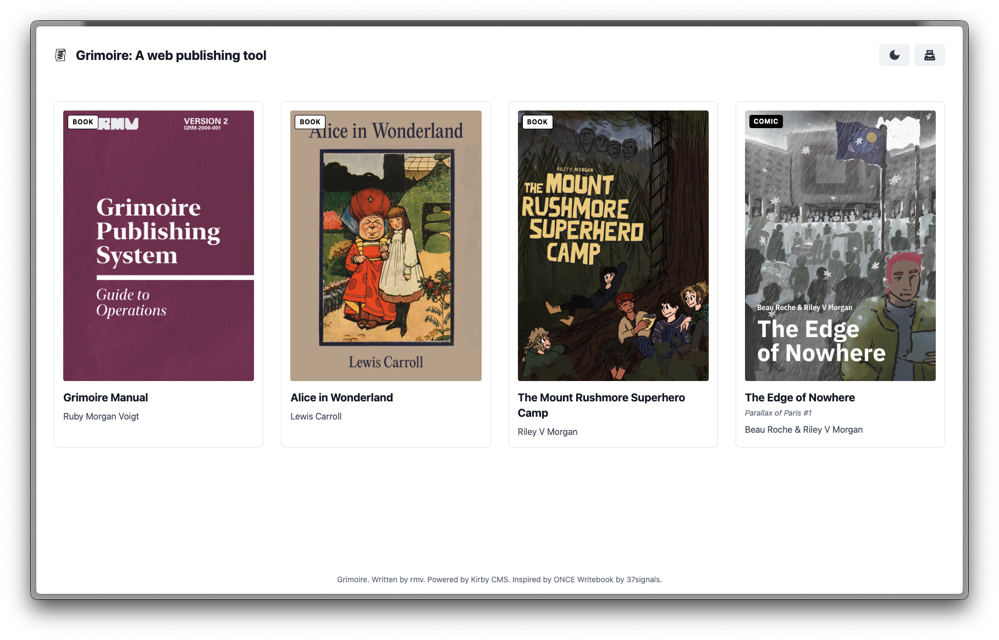

# Kirby Grimoire

A web publishing tool for the modern web.
Inspired by ONCE Writebook, implemented in Kirby 4.
Find a demo [here](https://read.rmv.fyi/).

## Features

### Books
Write in Markdown, publish to the web, and share your work with the world.
Or, if you don't want to, keep it private and share it with a select few.

### Comics (New in V2)
Publish webcomics with a dedicated comic reader interface:
- Upload image files as comic pages with drag-and-drop ordering
- Add page titles, captions, and alt text for accessibility
- Include expandable author commentary on individual pages
- Organise pages into chapters with optional chapter titles
- Content rating system (SFW/NSFW/NSFL) with automatic blurring
- Series support with volume numbering
- Reading progress tracking and resume functionality
- Keyboard navigation (arrow keys to move between pages)
- RSS feeds for new page updates

## Installation

1. Clone this repository to the web server you want to run it on.
2. Go to /panel and follow the installation instructions.
3. Enjoy!

Note: I probably won't update this unless there's game-breaking bugs, so PLEASE update Kirby to the latest version. You can do this by running `composer update` in the root directory of the project.

## Requirements

- PHP 8.2 or higher
- A webserver
- Something to share!

## License

Grimoire is in essence a "theme" for Kirby 4, as much as is possible with a system as flexible as Kirby, anyway.
As such, it is licensed under the same license as Kirby 4 itself, which is the [Kirby End User License Agreement](https://getkirby.com/license).
Kirby 4 is not free software. You are allowed to use it for evaluation purposes only. If you want to use it in a live environment, you need to purchase a license from [getkirby.com](https://getkirby.com).

As for the content of this repository apart from Kirby's copyrighted code, it is licensed under the [MIT License](https://opensource.org/licenses/MIT).
This means you can do whatever you want with it, as long as you include the original license and copyright notice.

## Credits

- [Kirby](https://getkirby.com) for the CMS
- [ONCE Writebook](https://once.com/writebook) for the inspiration
- [Tailwind CSS](https://tailwindcss.com) for the CSS framework
